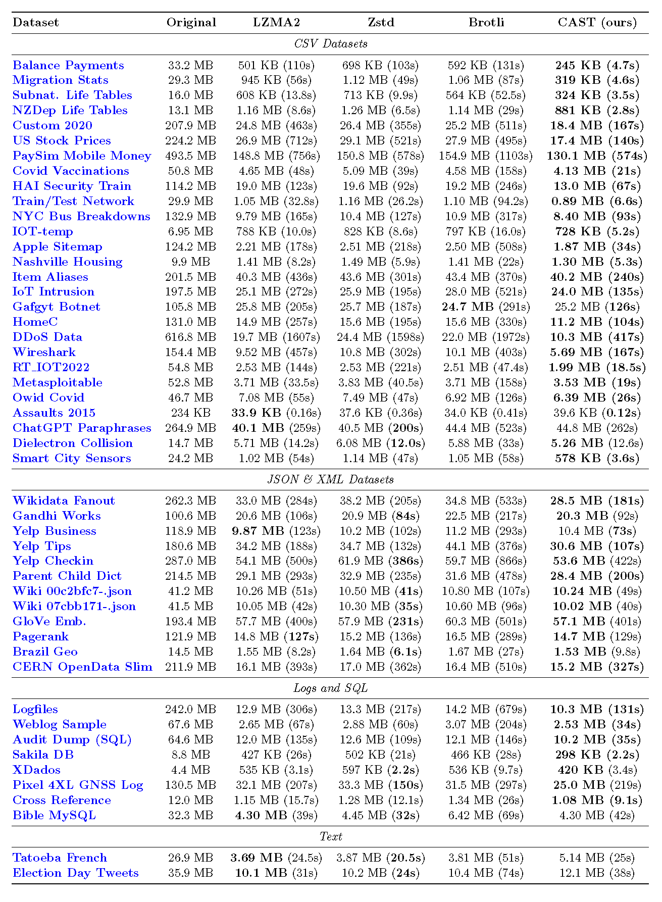
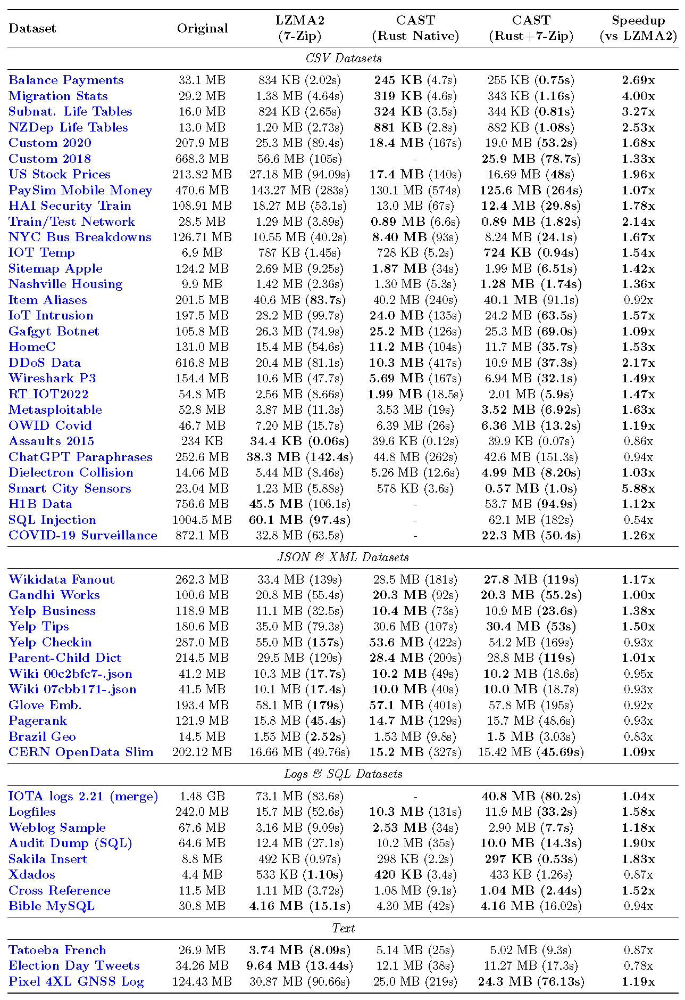
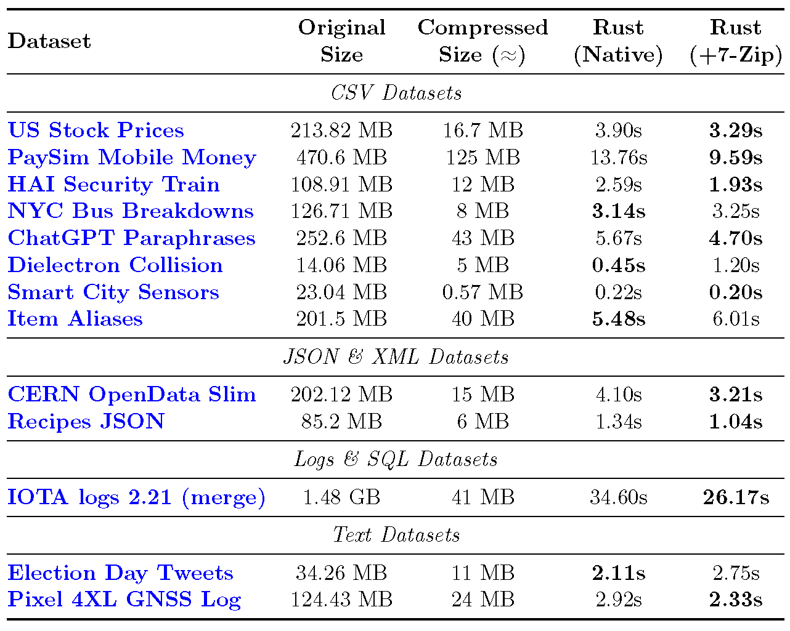

# CAST: Columnar Agnostic Structural Transformation

> **A research proof-of-concept for schema-less structural pre-processing. CAST reduces structural entropy in machine-generated data, enabling general-purpose compressors to detect long-range redundancy.**


---

### 📖 [Read the Scientific Paper](./paper/CAST_Paper.pdf)
**For more details please refer to the full paper available in this repository.**

---

## 🔬 Overview

**CAST** is a structural pre-processor designed to evaluate the impact of **columnar reorganization** on general-purpose compression pipelines (such as LZMA2, Zstd, and Brotli).

Standard stream compressors rely on finite "look-back" windows (dictionaries), which limits their ability to detect redundancy in verbose, row-oriented formats like CSV, Logs, or JSON. CAST parses the input structure globally, separating the syntax (**Skeleton**) from the values (**Variables**), and reorganizes the data into contiguous columnar streams before passing them to the backend compressor.

This repository contains the source code and benchmarking tools used to produce the experimental results detailed in the accompanying paper.

---

## ⚡ Key Features

* 🧠 **Schema-less Inference**: Uses an **Optimized Adaptive Parser** (zero-allocation) to automatically detect repetitive patterns in **any structured text stream**, operating purely on syntax without relying on file extensions or predefined schemas.
* 📦 **Enhanced Density**: Reduces structural entropy, allowing standard compressors (LZMA2, Zstd, Brotli, etc) to achieve significantly higher compression ratios **on structured texts**.
* 🚀 **Throughput Efficiency**: For **highly structured inputs**, the reduced entropy of the columnar streams lowers the backend encoding cost, often resulting in a net reduction of total execution time despite the parsing overhead.
* 🛡️ **Robustness**: Includes a **Binary Guard** heuristic to automatically detect and passthrough non-structured or binary files, preventing data corruption or inefficiency.

---

## 📊 Benchmarks & Performance Evaluation

> **ℹ️ Note on Backend:** While the CAST algorithm is fundamentally backend-agnostic (compatible with LZMA, Zstd, Brotli, etc.), the implementations provided in this repository are specifically tuned to leverage **LZMA2** as the reference backend to demonstrate maximum compression density.

To provide a comprehensive evaluation, this project features **two distinct implementations**:

1.  **🦀 Rust Performance Engine:** The core implementation used for **ALL official benchmarks**.
    * *Native Mode:* Standalone, dependency-free. Used to measure **Algorithmic Efficiency (Compression Ratio)** without external overhead.
    * *System Mode (7-Zip Backend):* Pipes data to the external 7-Zip executable (LZMA2). Used to demonstrate **Production Throughput** and scalability in real-world pipelines.
2.  **🐍 Python Reference:** A **simplified** implementation provided solely for **educational purposes** and algorithmic readability. **It was NOT used for any benchmark results presented in the paper.**

> 📂 **Data Sources:** Benchmarks were performed on real-world datasets sourced from Kaggle and Open Data repositories. For a full list of source URLs and descriptions, please refer to [DATASETS.md](./DATASETS.md).

> **⚠️ Note on Benchmarking Methodology:**
>
> 1.  **Compression Ratio (Table 1):** Measured using **Rust Native** to strictly isolate the algorithmic efficiency of the structural transformation.
> 2.  **Throughput & Speedup (Table 2):** Evaluates the **CAST Pipeline (using 7-Zip)** against the **Standard 7-Zip Baseline**.
>     * This ensures a strictly fair comparison: both pipelines use the **exact same backend encoder binary** (7-Zip/LZMA2) and threading model. The observed speedup is attributable solely to the entropy reduction achieved by CAST's pre-processing.
>     * **Extended Dataset:** This suite includes **additional large-scale datasets** (e.g., >500 MB) tested exclusively in this mode to demonstrate the pipeline's scalability under heavy load conditions.

### 1. Algorithmic Efficiency (Compression Ratio)
*Objective: Validate the mathematical efficiency of the structural transformation.*

The table below compares **CAST (Rust Native)** against state-of-the-art compressors at their maximum settings. As shown, CAST demonstrates superior density **on structured inputs**, often delivering significantly faster encoding times due to reduced backend complexity.<br> **Conversely, on unstructured or high-entropy data where no clear pattern can be inferred, the algorithm automatically falls back to standard compression, yielding neutral or slightly worse results.**
> **⚖️ Fair Comparison Methodology:**
> To ensure a strictly fair comparison, all tests in this section were restricted to **single-threaded, monolithic execution** (loading the full dataset into memory), effectively isolating pure algorithmic efficiency from parallelization gains.
> * **LZMA2 Parity:** The exact same configuration (Preset 9 Extreme, 128 MB Dictionary) was used for both the standalone LZMA2 competitor and the CAST backend.
> * **Competitor Settings:** Zstd and Brotli were configured to their maximum compression levels (Level 22 and Quality 11, respectively).
>
> *Please refer to the full paper for detailed configuration parameters.*



> *(See `paper/CAST_Paper.pdf` for high-resolution data)*

### 2. Production Throughput & Speedup (Rust System Mode)
*Objective: Evaluate viability in high-performance pipelines.*

Here we measure the real-world "Time-to-Compression" trade-off.

**Key Finding:** Contrary to the expectation that pre-processing adds latency, CAST is often **faster** than running standard compression directly on highly structured datasets. The entropy reduction allows the backend encoder to process the stream so efficiently that the **time saved during encoding outweighs the parsing overhead**.



> *(See `paper/CAST_Paper.pdf` for high-resolution data)*

### 3. Decompression Overhead (Rust Implementations)
*Objective: Quantify the cost of structural reconstruction.*

Decompression involves decoding the columnar streams and re-assembling the original row-oriented layout ($S + V \rightarrow L$). The data below measures the **full restoration time** required by the CAST engine.

**Observation:** The reconstruction phase is strictly linear (O(N)). Thanks to the optimized architecture of the Rust engine, the re-serialization overhead is minimized, ensuring high throughput.



> *(See `paper/CAST_Paper.pdf` for high-resolution data)*

---

## 🛠️ Methodology

The core premise of CAST is that structured text lines ($L$) can be decomposed into a static template ($S$) and a variable vector ($V$):

$$L \rightarrow S + V$$

Unlike formats like Parquet which require a pre-defined schema, CAST infers this structure dynamically using an **Optimized Adaptive Parser**.

### The Pipeline
1.  **Adaptive Inference**: The algorithm analyzes a sample of the input stream to select the optimal parsing strategy (e.g., **Strict** for delimited formats like CSV/JSON, **Aggressive** for unstructured Logs) based on structural consistency.
2.  **Decomposition**: Valid lines are stripped of their variable data. The static structure is stored once as a **Skeleton**, while dynamic values are extracted as **Variables**.
3.  **Columnar Transposition**: Variable vectors are transposed from a row-oriented layout into contiguous column-oriented blocks.
4.  **Entropy Reduction**: By grouping similar data types together (e.g., a continuous stream of timestamps or IP addresses), CAST maximizes **data locality**. This allows backend compressors (such as LZMA2, Zstd, or Brotli) to detect long-range repetitions that would be invisible in the raw row-based stream.

> 📄 **Scientific Paper:** For more details please refer to the **[CAST_Paper.pdf](./paper/CAST_Paper.pdf)** included in this repository.

---

## 🧪 Implementation Notes: Proof of Concept

This repository serves as a **scientific Proof of Concept (PoC)** to demonstrate the efficacy of the CAST algorithm. It provides two distinct implementations, each with a specific research goal:

### 1. 🦀 Rust Implementation (The Benchmark Engine)
* **Goal:** **High-Performance, Density & Scalability.**
* **Method:** A performance-oriented **research prototype** featuring **Zero-Copy Parsing**, **Multithreading**, and **Stream Chunking** to handle gigabyte-sized files with constant memory footprint.
* **Modes:**
    * **Native Mode:** Standalone implementation. Used to validate the **Algorithmic Efficiency (Maximum Density)** presented in Table 1.
    * **System Mode (7-Zip):** Invokes the external `7-Zip` CLI. Used to validate **Production Throughput** presented in Table 2.
* **Pros:**
    * **Speed:** significantly faster on complex datasets, leveraging Rust's zero-cost abstractions.
    * **Scalability:** The `--chunk-size` feature guarantees a constant low-memory footprint, preventing OS swapping.
* **⚠️ Maturity Note:** While quite optimized and functional, this is **experimental code**. It lacks the extensive error handling, fuzz-testing, and security auditing required for a production-grade compression tool. It is intended to benchmark the *algorithm*, not to replace tools like `xz` or `zstd` in critical environments.

### 2. 🐍 Python Implementation (Educational Reference)
* **Goal:** **Algorithmic Readability & Logic Validation.**
* **Method:** A high-level implementation relying on **Standard Regex** for pattern detection.
* **Role:** Designed as a readable reference for researchers to understand the core decomposition logic. It prioritizes code clarity over raw execution speed.
* **⚠️ Limitation:** Due to the overhead of the regex engine and the interpreter, this version is **not** intended for performance profiling and was **not** used for the official benchmarks.

---

## 🚀 Usage

Since this project offers multiple implementations, detailed usage instructions, dependencies, and build commands are provided in the respective directories:

* **📂 [Rust Implementation](./rust_impl/)**: Refer to the inner README to choose between the **7-Zip Backend** or **Native** version and for compilation steps.
* **📂 [Python Implementation](./python_impl/)**: Follow the instructions in the inner README to run the reference scripts.

---

## 📜 Citation

If you use CAST in your research or production pipeline, please cite it as:

```bibtex
@software{cast,
  author = {Olivari, Andrea},
  title = {CAST: Columnar Agnostic Structural Transformation},
  year = {2025},
  url = {[https://github.com/AndreaLVR/CAST](https://github.com/AndreaLVR/CAST)},
  note = {A Schema-less Structural Preprocessing Algorithm for Improving General-Purpose Compression on Structured Data.}
}
```

---

## 📄 License
This project is open-source and available under the MIT License.
