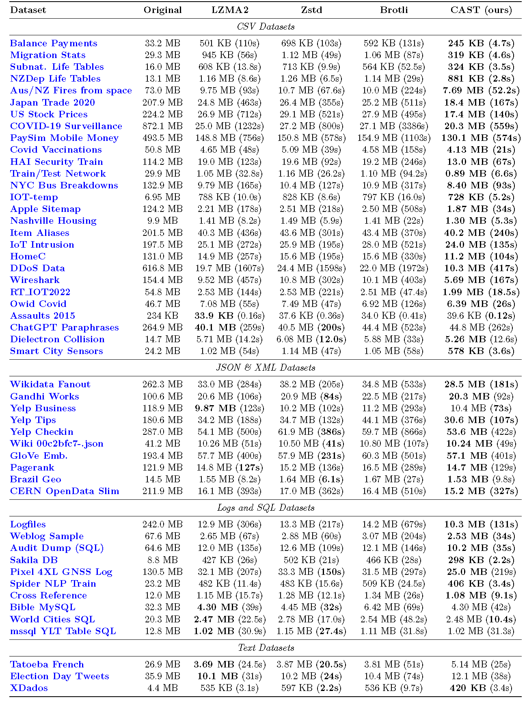
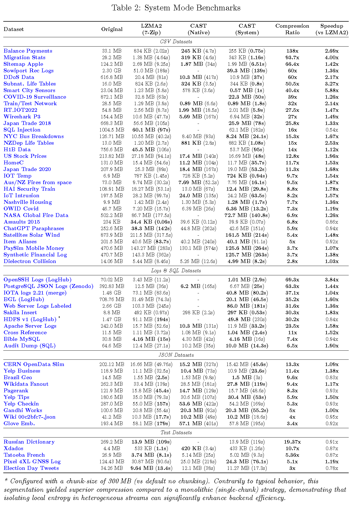
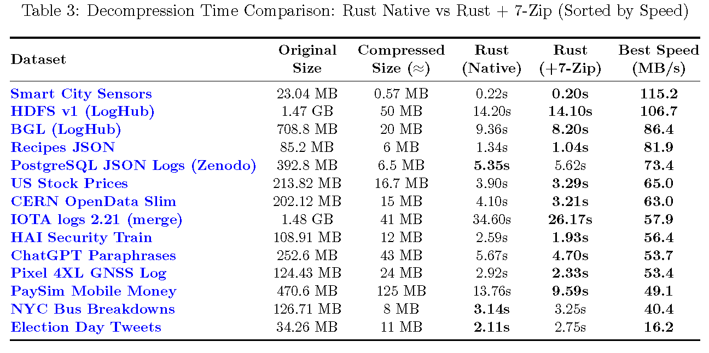

# CAST: Columnar Agnostic Structural Transformation

> **A research proof-of-concept for schema-less structural pre-processing. CAST reduces structural entropy by reorganizing data layout, enabling general-purpose compressors to achieve higher compression ratios and superior throughput on arbitrary structured and semi-structured text streams.**


---

### 📖 [Read the Technical Paper](./paper/CAST_Paper.pdf)
**For more details please refer to the full paper available in this repository.**

---

## 🔬 Overview

**CAST** is a structural pre-processor designed to demonstrate the potential of columnar reorganization on general-purpose compression pipelines (such as LZMA2, Zstd, and Brotli).

Standard stream compressors rely on finite "look-back" windows (dictionaries), which limits their ability to detect redundancy in verbose, row-oriented formats like CSV, Logs, or JSON. CAST parses the input structure globally, separating the syntax (**Skeleton**) from the values (**Variables**), and reorganizes the data into contiguous columnar streams before passing them to the backend compressor.

This repository contains the source code and benchmarking tools used to produce the experimental results detailed in the accompanying paper.

---

## Key Features

* 🧠 **Schema-less Inference**: Uses an **Optimized Adaptive Parser** to automatically detect repetitive patterns in **arbitrary structured and semi-structured text streams**, operating purely on syntax without relying on file extensions or predefined schemas.
* 📦 **Enhanced Compression Density**: Maximizes efficiency for Cold Storage & Archival by significantly reducing disk footprint, while simultaneously optimizing Bandwidth-Limited Transmission (e.g., Edge-to-Cloud logging). Ideally paired with high-ratio backends like LZMA2 to minimize infrastructure costs.
* 🚀 **Throughput Efficiency**: For **structured and semi-structured inputs**, the reduced entropy of the columnar streams lowers the backend encoding cost, often resulting in a net reduction of total execution time despite the parsing overhead.
* 🛠️ **Memory Scalability & Safety**: Features a fully **Streaming Decompressor** that ensures **constant memory footprint** during restoration, effectively immune to OOM crashes regardless of file size. Includes configurable **Stream Chunking** and **Dictionary Size** control for compression on constrained systems.
* 🛡️ **Robustness**: Includes a **Binary Guard** heuristic to automatically detect and **bypass** non-structured or binary files, preventing processing overhead and ensuring data integrity.

---

## 🚀 Usage: A Familiar CLI Experience

CAST is designed to function as a **straightforward Command Line Interface (CLI)**, offering a drop-in user experience similar to standard utilities like `gzip`, `tar`, or `7z`.
It requires **no complex installation** or environment configuration: simply download and run.

> **👉 Get Started:**
> Detailed command references are strictly documented in the respective directories to ensure clarity:
> * **[📂 Rust Implementation](./rust/)** (**Recommended**): Instructions for the high-performance binary.
> * **[📂 Python Implementation](./py/)**: Instructions for the reference scripts.
> * **[📂 Random Access Preview](./rust_random_access_PREVIEW/)** (**Work In Progress Early Research Prototype**): An Early Research Prototype introducing Row Groups and O(1) Seeking.

---

## 🔮 Current Scope & Future Direction

### ⚡ Current Focus: Archival & Full Restoration
CAST is currently designed as a stream transformer for **high-efficiency archival**.
* **Primary Goal:** Maximize storage density for long-term retention, while maintaining practical restoration speeds.
* **Access Pattern:** **Sequential Access**. The tool is optimized for scenarios where the full file is restored for processing.

### 🔭 Research Preview: Random Access
The internal architecture is inherently **Block-Based**, providing a foundation for seekability. We are actively developing an **Indexed Row Group** format to enable efficient Random Access (e.g., "fetch lines 1000-2000") without compromising the primary goal of compression density.

> **🚧 Try the Preview:** A **WIP experimental** implementation of this architecture is now available in the **[rust_random_access_PREVIEW](./rust_random_access_PREVIEW/)** directory. It introduces independent block compression and footer indexing to allow O(1) extraction.

---

## 📊 Benchmarks & Performance Evaluation

> **ℹ️ Note on Backend:** While the CAST algorithm is fundamentally backend-agnostic, the implementations provided here are tuned to leverage **LZMA2 to demonstrate maximum compression density** (using a 128 MB dictionary). **Users prioritizing speed over raw density can pair CAST with faster backends (e.g., Zstd or LZ4), shifting the trade-off towards real-time processing**. However, the benchmarks below focus on the "Deep Archival" use-case where storage efficiency is paramount.

> **⚖️ Note on Dataset Composition:**
> The dataset selection is **intentionally weighted** towards the algorithm's target domain—structured and semi-structured text streams—to fully explore the optimization potential in relevant scenarios.
> However, to define the algorithm's operational boundaries, we also included a small control group representing **low-redundancy scenarios** (including unstructured text and high-variance structured files). This verifies that CAST's benefits are strictly dependent on *exploitable* structural redundancy.

To provide a comprehensive evaluation, this project features **two distinct implementations (Rust & Python)**, both supporting dual operating modes via the `--mode` flag:

1.  **🦀 Rust Performance Engine:** The core implementation used for **ALL official benchmarks**.
    * *Native Mode:* Standalone, dependency-free. Used to measure **Algorithmic Efficiency (Compression Ratio)** without external overhead.
    * *System Mode (7-Zip Backend):* Pipes data to the external 7-Zip executable (LZMA2). Used to demonstrate **Production Throughput** and scalability in real-world pipelines. This configuration achieves **significantly higher speeds** with **negligible compression loss** compared to the Native version.

> 📂 **Data Sources:** Benchmarks were performed on real-world datasets sourced from Kaggle and Open Data repositories. For a full list of source URLs and descriptions, please refer to [DATASETS.md](./DATASETS.md).

> **⚠️ Note on Benchmarking Methodology:**
>
> 1.  **Compression Ratio (Table 1):** Measured using the **Native mode** to strictly isolate the algorithmic efficiency of the structural transformation.
> 2.  **Throughput & Speedup (Table 2):** Evaluates the **CAST Pipeline (using 7-Zip)** against the **Standard 7-Zip Baseline**.
>       * This ensures a strictly fair comparison: both pipelines use the **exact same backend encoder binary** (7-Zip/LZMA2) and threading model. The observed speedup is attributable solely to the entropy reduction achieved by CAST's pre-processing.
>       * **Extended Dataset:** This suite includes **additional large-scale datasets** (e.g., >500 MB) tested exclusively in this mode to demonstrate the pipeline's scalability under heavy load conditions.

### 1. Algorithmic Efficiency (Compression Ratio)
*Objective: Validate the mathematical efficiency of the structural transformation.*

The table below compares **CAST (Rust Native)** against state-of-the-art compressors at their maximum settings. As shown, CAST demonstrates superior density **on structured and semi-structured inputs**, often delivering significantly faster encoding times due to reduced backend complexity.<br> **Conversely, on unstructured or high-entropy data where no clear pattern can be inferred, the algorithm automatically falls back to standard compression, yielding neutral or slightly worse results.**
> **⚖️ Fair Comparison Methodology:**
> To ensure a strictly fair comparison, all tests in this section were restricted to **single-threaded, monolithic execution** (loading the full dataset into memory), effectively isolating pure algorithmic efficiency from parallelization gains.
> * **LZMA2 Parity:** The exact same configuration (Preset 9 Extreme, 128 MB Dictionary) was used for both the standalone LZMA2 competitor and the CAST backend.
> * **Competitor Settings:** Zstd and Brotli were configured to their maximum compression levels (Level 22 and Quality 11, respectively).
>
> *Please refer to the full paper for detailed configuration parameters.*



> *(See `paper/CAST_Paper.pdf` for high-resolution data)*

### 2. Production Throughput & Speedup (Rust System Mode)
*Objective: Evaluate viability in high-performance pipelines.*

Here we measure the real-world "Time-to-Compression" trade-off.

**Key Finding:** Contrary to the expectation that pre-processing adds latency, CAST is often **faster** than running standard compression directly on structured and semi-structured datasets. The entropy reduction allows the backend encoder to process the stream so efficiently that the **time saved during encoding outweighs the parsing overhead**.



> *(See `paper/CAST_Paper.pdf` for high-resolution data)*

### 3. Decompression Overhead (Rust Implementations)
*Objective: Quantify the cost of structural reconstruction.*

Decompression involves decoding the columnar streams and re-assembling the original row-oriented layout ($S + V \rightarrow L$). The data below measures the **full restoration time** required by the CAST engine.

**Observation:** The reconstruction phase is strictly linear ($O(N)$). The engine utilizes **buffered streaming I/O** to maximize throughput while maintaining a **minimal, constant RAM profile**, ensuring stability even when restoring multi-gigabyte files on low-memory hardware.



> *(See `paper/CAST_Paper.pdf` for high-resolution data)*

---

## 🛠️ Methodology

The core premise of CAST is that structured text lines ($L$) can be decomposed into a static template ($S$) and a variable vector ($V$):

$$L \rightarrow S + V$$

Unlike formats like Parquet which require a pre-defined schema, CAST infers this structure dynamically using an **Optimized Adaptive Parser**.

### The Pipeline
1.  **Adaptive Inference**: The algorithm analyzes a sample of the input stream to select the optimal parsing strategy (e.g., **Strict** for delimited formats like CSV/JSON, **Aggressive** for unstructured Logs) based on structural consistency.
2.  **Decomposition**: Valid lines are stripped of their variable data. The static structure is stored once as a **Skeleton**, while dynamic values are extracted as **Variables**.
3.  **Columnar Transposition**: Variable vectors are transposed from a row-oriented layout into contiguous column-oriented blocks.
4.  **Entropy Reduction**: By grouping similar data types together (e.g., a continuous stream of timestamps or IP addresses), CAST maximizes **data locality**. This allows backend compressors (such as LZMA2, Zstd, or Brotli) to detect long-range repetitions that would be invisible in the raw row-based stream.

> 📄 **Scientific Paper:** For more details please refer to the **[CAST_Paper.pdf](./paper/CAST_Paper.pdf)** included in this repository.

---

## 🧪 Implementation Notes: Proof of Concept

This repository serves as a **scientific Proof of Concept (PoC)** to demonstrate the efficacy of the CAST algorithm. It provides two distinct implementations, each with a specific research goal:

### 1. 🦀 Rust Implementation (The Benchmark Engine)
* **Goal:** **High-Performance, Density & Scalability.**
* **Method:** A performance-oriented **research prototype** featuring a **Zero-Copy Parsing Strategy**, **Multithreading**, and **Stream Chunking** (compression) paired with **Streaming I/O** (decompression) to handle gigabyte-sized files with a constant memory footprint.* **Unified Architecture:** The engine supports dynamic backend selection via the `--mode` flag:
    * **Native Mode:** Standalone implementation. Used to validate the **Algorithmic Efficiency (Maximum Density)** presented in Table 1.
    * **System Mode (7-Zip):** Invokes the external `7-Zip` CLI. Used to validate **Production Throughput**.
      > **💡 Recommendation:** This is the **preferred variant** for general usage. It achieves drastic speedups with **negligible compression loss** compared to the Native version.
* **Pros:**
    * **Speed:** significantly faster on complex datasets, leveraging Rust's zero-cost abstractions.
    * **Scalability:** The `--chunk-size` (compression) and **Streaming Architecture** (decompression) guarantee a constant and configurable memory footprint, preventing OS swapping or OOM errors.
* **⚠️ Maturity & Performance:** This engine is **engineered for robustness and high performance**, incorporating specific safeguards like **strictly bounded memory usage** and **automated binary detection** to prevent instability.
    In particular, the **System Mode** pipeline demonstrates **Production-Grade Throughput**, often **exceeding the encoding speed of the standard 7-Zip baseline**.
    However, it is classified as a **Research Prototype** primarily due to its recent development: it lacks the decades of community fuzz-testing and security auditing present in legacy tools like `xz` or `zstd`. It is fully functional and stable for benchmarking and archival, but should be evaluated with the awareness that it is a newly developed codebase.


### 2. 🐍 Python Implementation (Educational Reference)
* **Goal:** **Algorithmic Readability & Logic Validation.**
* **Architecture:** Same dual-mode design as Rust (`native` vs `7zip` backends), controllable via CLI args.
* **Method:** A high-level implementation relying on **Standard Regex** for pattern detection, chosen for code clarity over the zero-copy byte parsing used in Rust.
* **Role:** Designed as a readable reference for researchers to understand the core decomposition logic. It fully supports **Chunking** and **Dictionary Size configuration** via CLI to ensure **format compatibility**, but employs a simplified **in-memory reconstruction model** (unlike the optimized streaming architecture of the Rust engine).
* **⚠️ Limitation:** Due to the overhead of the regex engine and the interpreter, this version is **not** intended for performance profiling and was **not** used for the official benchmarks presented in the paper.

---

## 📜 Citation

If you use CAST in your research or production pipeline, please cite it as:

```bibtex
@software{cast,
  author = {Olivari, Andrea},
  title = {CAST: Columnar Agnostic Structural Transformation},
  year = {2026},
  url = {https://github.com/AndreaLVR/CAST},
  note = {A Schema-less Structural Preprocessing Algorithm for Improving General-Purpose Compression on Structured and Semi-structured Text Streams.}
}
```

---

## 📄 License
This project is open-source and available under the MIT License.
