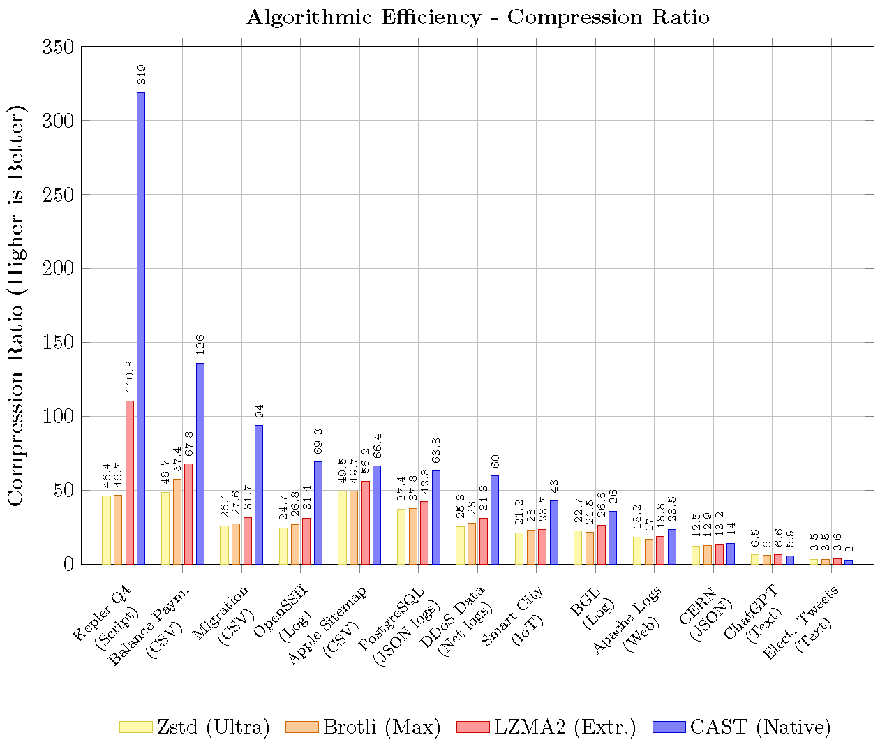
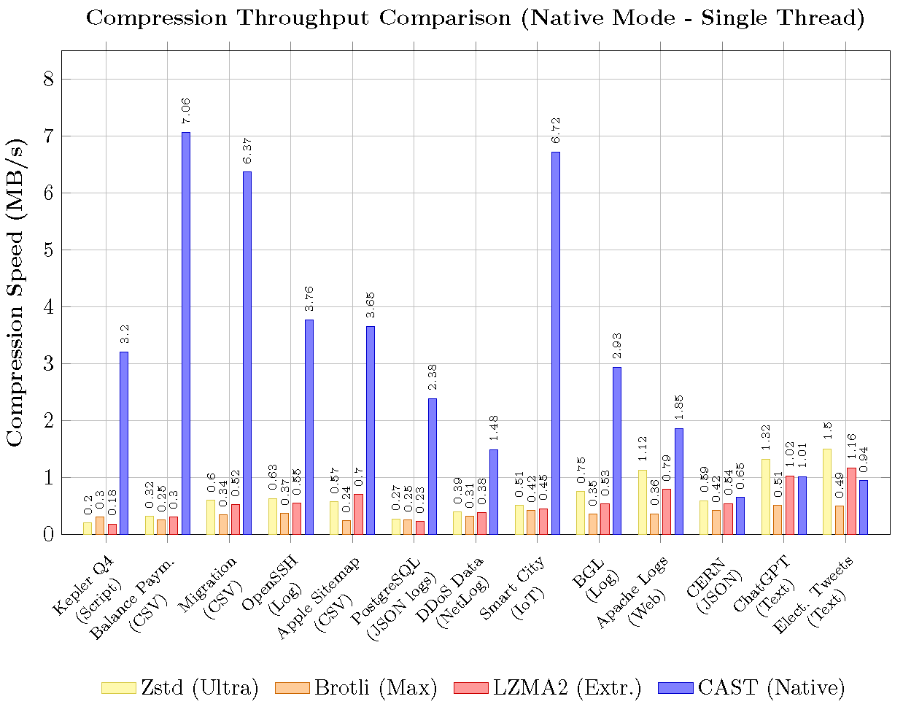
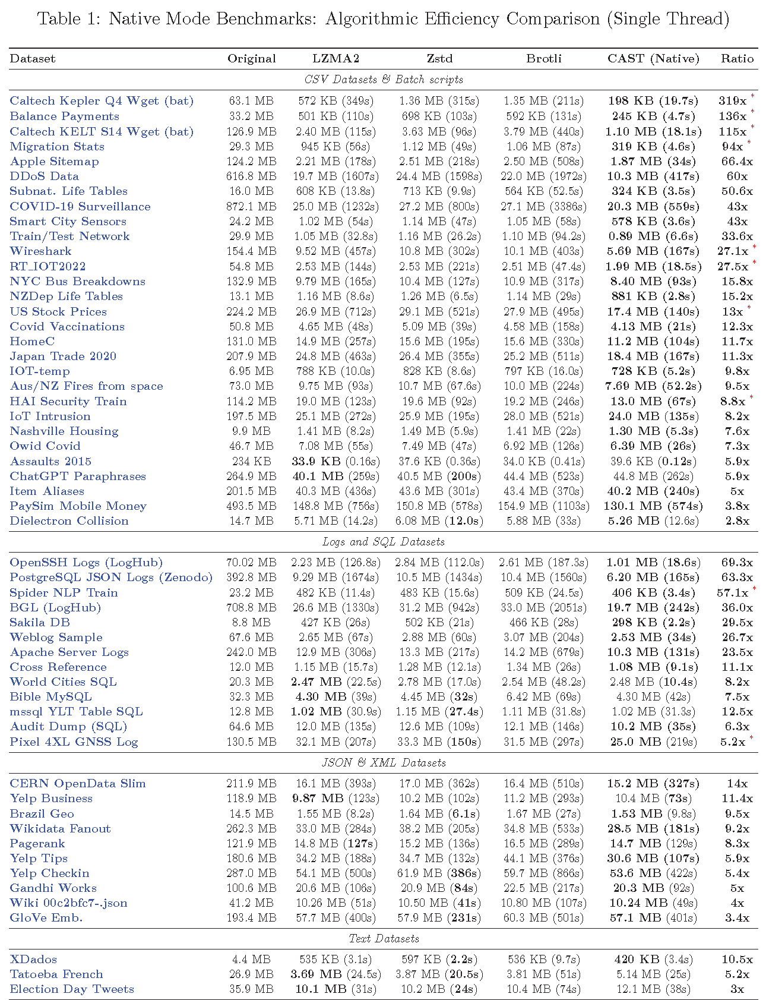
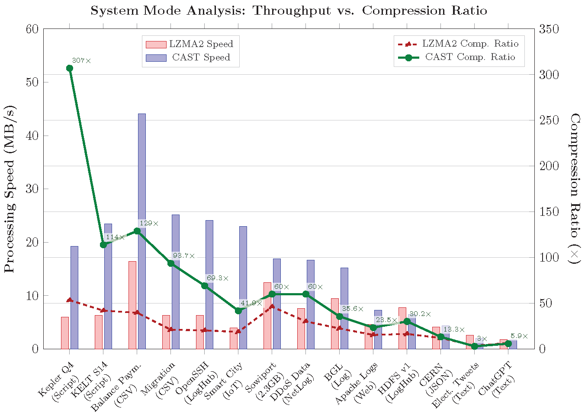
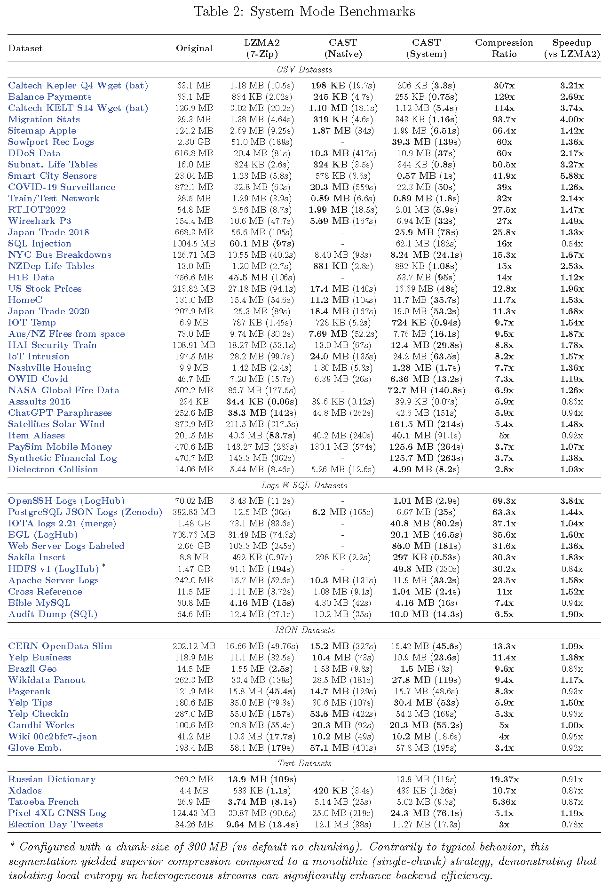
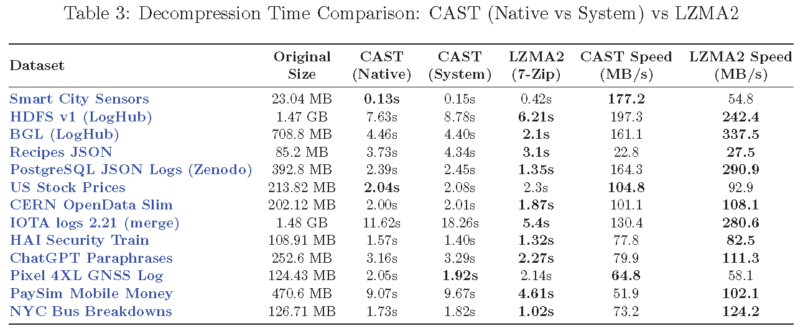

# CAST: Columnar Agnostic Structural Transformation

> **A research proof-of-concept for schema-less structural pre-processing. CAST reduces structural entropy by reorganizing data layout, enabling general-purpose compressors to achieve higher compression ratios and superior compression throughput on arbitrary structured and semi-structured text streams.**


---

### 📖 [Read the Technical Paper](./paper/CAST_Paper.pdf)
**For more details please refer to the full paper available in this repository.**

---

## 🔬 Overview

**CAST** is a structural pre-processor **currently** optimized for **High-Ratio Archival and Storage Efficiency**, while **laying the architectural foundation** for a **Random Access** system.

Standard stream compressors rely on finite "look-back" windows, limiting their ability to detect redundancy in verbose formats like CSV or Logs. CAST parses the input globally, separating syntax (**Skeleton**) from values (**Variables**), and reorganizes them into contiguous columnar streams.

* **Current State (Maximum Density):** By maximizing data locality, CAST enables backend compressors to achieve extreme ratios. This is ideal for **Cold Storage** (minimizing footprint) and **Constrained Bandwidth Scenarios** (e.g., reducing transfer costs for Edge-to-Cloud logging).
* **Architectural Potential (Random Access):** Unlike solid archives (e.g., `tar.gz`), CAST's internal design is inherently **Block-Based**. This structure lays the foundation for **O(1) Indexed Random Access** (see **Experimental Preview** below), enabling efficient partial retrieval without full decompression.

This repository contains the source code and benchmarking tools used to produce the experimental results detailed in the accompanying paper.

---

## Key Features

* 🧠 **Schema-less Inference**: Uses an **Optimized Adaptive Parser** to automatically detect repetitive patterns in **arbitrary structured and semi-structured text streams**, operating purely on syntax without relying on file extensions or predefined schemas.
* 📦 **Enhanced Compression Density**: Maximizes efficiency for Cold Storage & Archival by significantly reducing disk footprint, while simultaneously optimizing Bandwidth-Limited Transmission (e.g., Edge-to-Cloud logging). Ideally paired with high-ratio backends like LZMA2 to minimize infrastructure costs.
* 🚀 **Throughput Efficiency**: For **structured and semi-structured inputs**, the reduced entropy of the columnar streams lowers the backend encoding cost, often resulting in a net reduction of total execution time despite the parsing overhead.
* 🛠️ **Memory Scalability & Safety**: Features a **Block-Based Streaming Architecture**. The engine processes data in chunks and **streams the output incrementally**, keeping memory usage **bounded by the compressed block size** (plus a small constant buffer). This ensures OOM immunity during restoration—provided explicit **Stream Chunking** was enabled during compression—regardless of the total output size.
* 🛡️ **Robustness**: Includes a **Binary Guard** heuristic to automatically detect and **bypass** non-structured or binary files, preventing processing overhead and ensuring data integrity.
* 🔭 **Random Access Architecture [EXPERIMENTAL PREVIEW]**: The internal architecture is inherently **Block-Based**, providing a foundation for seekability. We have **just started investigation and development** on an **Indexed Row Group** format to enable efficient Random Access (e.g., "fetch lines 1000-2000") without compromising the primary goal of compression density. This is currently a strictly experimental proof-of-concept.

---

## 🚀 Usage: A Familiar CLI Experience - Zero Setup

CAST is designed to function as a **straightforward Command Line Interface (CLI)**, offering a drop-in user experience similar to standard utilities like `gzip`, `tar`, or `7z`.
It requires **no installation** or environment configuration: **simply download and run**.

### 📥 [Download Latest Release](https://github.com/AndreaLVR/CAST/releases/tag/v1.0.0)
*(Binaries built from the **Rust Implementation** for Windows, Linux, and macOS)*

> **🧪 Experimental:** Looking for the **Random Access Prototype**?
> A pre-compiled **Alpha Build** of the O(1) seeking engine is available [here](https://github.com/AndreaLVR/CAST/releases/tag/v0.2.0-beta) (look for files tagged `preview`).
> **⚠️ Note:** **Investigation and development** on this feature have **just started**. This is a raw **Proof-of-Concept** released solely to demonstrate the feasibility of the Row Group architecture. It is NOT feature-complete.
> 
> **👉 Get Started:**
> Detailed command references are strictly documented in the respective directories to ensure clarity:
> * **[📂 Rust Implementation](./rust/)** (**Recommended**): Instructions for the official high-performance binaries.
> * **[📂 Python Implementation](./py/)** (**Conceptual Reference**): A simplified implementation provided **solely for logic validation and research**.
> * **[📂 Random Access Preview](./rust_random_access_PREVIEW/)** (**Investigation & Development**): Documentation for the Early Prototype (Row Groups & O(1) Seeking).

### ⚡ Smart Defaults
The **Rust Engine** automatically adopts a **Hybrid Strategy** to give you the best performance out of the box:
* **Compression:** Defaults to **System Mode (7-Zip)** (if available) to maximize multi-threaded throughput.
* **Decompression:** Defaults to **Native Mode** to minimize process latency and overhead.

---


## 📊 Benchmarks & Performance Evaluation

> **ℹ️ Note on Backend:** While the CAST algorithm is fundamentally backend-agnostic, the implementations provided here are tuned to leverage **LZMA2 to demonstrate maximum compression density** (using a 128 MB dictionary). **Users prioritizing speed over raw density can pair CAST with faster backends (e.g., Zstd or LZ4), shifting the trade-off towards real-time processing**. However, the benchmarks below focus on the "Deep Archival" use-case where storage efficiency is paramount.

> **⚖️ Note on Dataset Composition:**
> The dataset selection is **intentionally weighted** towards the algorithm's target domain—structured and semi-structured text streams—to fully explore the optimization potential in relevant scenarios.
> However, to define the algorithm's operational boundaries, we also included a small control group representing **low-redundancy scenarios** (including unstructured text and high-variance structured files). This verifies that CAST's benefits are strictly dependent on *exploitable* structural redundancy.

To provide a comprehensive evaluation, all official benchmarks were conducted using the **🦀 Rust Performance Engine**.
The engine supports dual operating configurations, controllable via the `--mode` CLI argument:

1. **Native Mode** (`--mode native`): Standalone, dependency-free. Used to measure **Algorithmic Efficiency (Compression Ratio)** without external overhead.
2. **System Mode** (`--mode 7zip`): Pipes data to the external 7-Zip executable (LZMA2). Used to demonstrate **Production Throughput** and scalability in real-world pipelines. This configuration achieves **significantly higher speeds** with **negligible compression loss** compared to the Native version.

> 📂 **Data Sources:** Benchmarks were performed on real-world datasets sourced from Kaggle and Open Data repositories. For a full list of source URLs and descriptions, please refer to [DATASETS.md](./DATASETS.md).

> **⚠️ Note on Benchmarking Methodology:**
>
> 1.  **Compression Ratio (Table 1):** Measured using the **Native mode** to strictly isolate the algorithmic efficiency of the structural transformation.
> 2.  **Throughput & Speedup (Table 2):** Evaluates the **CAST Pipeline (using 7-Zip)** against the **Standard 7-Zip Baseline**.
>       * This ensures a strictly fair comparison: both pipelines use the **exact same backend encoder binary** (7-Zip/LZMA2) and threading model. The observed speedup is attributable solely to the entropy reduction achieved by CAST's pre-processing.
>       * **Extended Dataset:** This suite includes **additional large-scale datasets** (e.g., >500 MB) tested exclusively in this mode to demonstrate the pipeline's scalability under heavy load conditions.

### 1. Algorithmic Efficiency (Compression Ratio)
*Objective: Validate the mathematical efficiency of the structural transformation.*

The table below compares **CAST (Rust Native)** against state-of-the-art compressors at their maximum settings. As shown, CAST demonstrates superior density **on structured and semi-structured inputs**, often delivering significantly faster encoding times due to reduced backend complexity.<br> **Conversely, on unstructured or high-entropy data where no clear pattern can be inferred, the algorithm automatically falls back to standard compression, yielding neutral or slightly worse results.**
> **⚖️ Fair Comparison Methodology:**
> To ensure a strictly fair comparison, all tests in this section were restricted to **single-threaded, monolithic execution** (loading the full dataset into memory), effectively isolating pure algorithmic efficiency from parallelization gains.
> * **LZMA2 Parity:** The exact same configuration (Preset 9 Extreme, 128 MB Dictionary) was used for both the standalone LZMA2 competitor and the CAST backend.
> * **Competitor Settings:** Zstd and Brotli were configured to their maximum compression levels (Level 22 and Quality 11, respectively).
> * **Extreme Baseline (ZPAQ):** We cross-referenced results against **ZPAQ (-m5)**. Instances where CAST outperforms even this extreme density benchmark are explicitly marked with a **red asterisk (*)** in the table below.
>
> *Please refer to the full paper for detailed configuration parameters.*


> *Figure 1: Comparison of compression ratios on a comprehensive and significant selection of datasets (sorted by CAST performance). CAST (Blue) shows dominant performance on structured/semi-structured data, doubling or tripling competitor density. The inclusion of unstructured/high entropy text (e.g., Elect. Tweets) demonstrates the natural boundary where structural pre-processing becomes neutral or slightly disadvantageous.*

<br>


> *Figure 2: Throughput Analysis (Native Mode). In single-threaded mode, CAST (Blue) achieves significantly higher throughput on CSVs and structured/semi-structured logs due to the reduced input size passed to the backend. On unstructured/high entropy text (ChatGPT, Tweets), the parsing overhead aligns performance with standard compressors.*

<details>
<summary><strong>🔍 CLICK TO EXPAND THE FULL BENCHMARKS TABLE</strong></summary>
<br>

<br>
<p><em>
<span style="color: #b31b1b;">*</span> <strong>Denotes datasets where CAST outperforms even ZPAQ (-m5) in compression density.</strong><br>
Specific comparisons: Kepler (198 KB vs 230 KB); KELT (1.10 MB vs 1.33 MB); Migration (319 KB vs 471 KB); Balance (245 KB vs 250 KB); Spider NLP (406 KB vs 461 KB); RT_IOT (1.99 MB vs 2.00 MB); Wireshark (5.69 MB vs 6.95 MB); HAI Security (13.0 MB vs 13.1 MB); US Stock (17.4 MB vs 17.6 MB); Pixel 4XL (25.0 MB vs 27.3 MB).
</em></p>
</details>

> *(See `paper/CAST_Paper.pdf` for high-resolution data)*

### 2. Production Throughput & Speedup (Rust System Mode)
*Objective: Evaluate viability in high-performance pipelines.*

Here we measure the real-world "Time-to-Compression" trade-off.

**Key Finding:** Contrary to the expectation that pre-processing adds latency, CAST is often **faster** than running standard compression directly on structured and semi-structured datasets. The entropy reduction allows the backend encoder to process the stream so efficiently that the **time saved during encoding outweighs the parsing overhead**.


> *Figure 3: System Mode Analysis. The chart reveals a strong positive correlation between compression efficiency (Green Line) and processing throughput (Blue Bars). In most cases, higher structural redundancy translates directly into faster encoding.*

<details>
<summary><strong>🔍 CLICK TO EXPAND THE FULL BENCHMARKS TABLE</strong></summary>
<br>

<br>
</details>

> *(See `paper/CAST_Paper.pdf` for high-resolution data)*

### 3. Decompression Overhead (Rust Implementations)
*Objective: Quantify the cost of structural reconstruction.*

Decompression involves decoding the columnar streams and re-assembling the original row-oriented layout ($S + V \rightarrow L$). The data below measures the **full restoration time** required by the CAST engine.

**Observation:** The reconstruction phase is strictly linear ($O(N)$). The engine utilizes buffered streaming I/O to maximize throughput while maintaining a memory profile bounded by the block size. This ensures stability even when restoring multi-gigabyte files on low-memory hardware, provided that Stream Chunking was utilized during the compression phase.


> *Figure 4: Decompression Performance Landscape. The chart benchmarks the native Rust implementation of CAST against the system-call variant and standard LZMA2. LZMA2 (orange) generally maintains a higher throughput, reflecting the computational trade-off required for CAST's structural reconstruction phase. Despite this overhead, CAST delivers consistently viable restoration speeds (50–200 MB/s), making it suitable for archival storage where density is the primary metric. Notably, on highly repetitive datasets (e.g., Smart City, US Stocks), the reduced I/O volume allows CAST to overcome the reconstruction cost and outperform the baseline.*

<details>
<summary><strong>🔍 CLICK TO EXPAND THE FULL BENCHMARKS TABLE</strong></summary>
<br>

<br>
</details>

> *(See `paper/CAST_Paper.pdf` for high-resolution data)*

---

## 🛠️ Methodology

The core premise of CAST is that structured text lines ($L$) can be decomposed into a static template ($S$) and a variable vector ($V$):

$$L \rightarrow S + V$$

Unlike formats like Parquet which require a pre-defined schema, CAST infers this structure dynamically using an **Optimized Adaptive Parser**.

### The Pipeline
1.  **Adaptive Inference**: The algorithm analyzes a sample of the input stream to select the optimal parsing strategy (e.g., **Strict** for delimited formats like CSV/JSON, **Aggressive** for unstructured Logs) based on structural consistency.
2.  **Decomposition**: Valid lines are stripped of their variable data. The static structure is stored once as a **Skeleton**, while dynamic values are extracted as **Variables**.
3.  **Columnar Transposition**: Variable vectors are transposed from a row-oriented layout into contiguous column-oriented blocks.
4.  **Entropy Reduction**: By grouping similar data types together (e.g., a continuous stream of timestamps or IP addresses), CAST maximizes **data locality**. This allows backend compressors (such as LZMA2, Zstd, or Brotli) to detect long-range repetitions that would be invisible in the raw row-based stream.

> 📄 **Scientific Paper:** For more details please refer to the **[CAST_Paper.pdf](./paper/CAST_Paper.pdf)** included in this repository.

---

## 🧪 Implementation Notes: Proof of Concept

This repository serves as a **scientific Proof of Concept (PoC)** to demonstrate the efficacy of the CAST algorithm. It provides two distinct implementations, each with a specific research goal:

### 1. 🦀 Rust Implementation (The Benchmark Engine)
* **Goal:** **High-Performance, Density & Scalability.**
* **Method:** A performance-oriented **research prototype** featuring a **Zero-Copy Parsing Strategy**, **Multithreading**, and **Stream Chunking** (compression) paired with **Streaming I/O** (decompression) to handle gigabyte-sized files with a constant memory footprint.* **Unified Architecture:** The engine supports dynamic backend selection via the `--mode` flag:
    * **Native Mode:** Standalone implementation. Used to validate the **Algorithmic Efficiency (Maximum Density)** presented in Table 1.
    * **System Mode (7-Zip):** Invokes the external `7-Zip` CLI via **streaming pipes**, performing operations entirely in-memory to eliminate disk I/O overhead. Used to validate **Production Throughput**.
      > **💡 Recommendation:** This is the preferred variant for compression. The Rust engine automatically selects this mode by default (if 7z is detected) to ensure the best out-of-the-box performance.
* **Pros:**
    * **Speed:** significantly faster on complex datasets, leveraging Rust's zero-cost abstractions.
    * **Scalability:** The `--chunk-size` parameter allows users to strictly bound the memory footprint during both compression and decompression, preventing OS swapping or OOM errors on constrained systems.
* **⚠️ Maturity & Performance:** This engine is **engineered for robustness and high performance**, incorporating specific safeguards like **strictly bounded memory usage** and **automated binary detection** to prevent instability.
    In particular, the **System Mode** pipeline demonstrates **Production-Grade Throughput**, often **exceeding the encoding speed of the standard 7-Zip baseline**.
    However, it is classified as a **Research Prototype** primarily due to its recent development: it lacks the decades of community fuzz-testing and security auditing present in legacy tools like `xz` or `zstd`. It is fully functional and stable for benchmarking and archival, but should be evaluated with the awareness that it is a newly developed codebase.


### 2. 🐍 Python Implementation (Educational Reference)
* **Goal:** **Algorithmic Readability & Logic Validation.**
* **Architecture:** Same dual-mode design as Rust (`native` vs `7zip` backends), controllable via CLI args.
* **Method:** A high-level implementation relying on **Standard Regex** for pattern detection, chosen for code clarity over the zero-copy byte parsing used in Rust.
* **Role:** Designed as a readable reference for researchers to understand the core decomposition logic. It fully supports **Chunking** and **Dictionary Size configuration** via CLI to ensure **format compatibility**, but employs a simplified **in-memory reconstruction model** (unlike the optimized streaming architecture of the Rust engine).
* **⚠️ Limitation:** Due to the overhead of the regex engine and the interpreter, this version is **not** intended for performance profiling and was **not** used for the official benchmarks presented in the paper.

---

## 📜 Citation

If you use CAST in your research or production pipeline, please cite it as:

```bibtex
@software{cast,
  author = {Olivari, Andrea},
  title = {CAST: Columnar Agnostic Structural Transformation},
  year = {2026},
  url = {https://github.com/AndreaLVR/CAST},
  note = {A Schema-less Structural Preprocessing Algorithm for Improving General-Purpose Compression on Structured and Semi-structured Text Streams.}
}
```

---

## 📄 License
This project is open-source and available under the MIT License.
