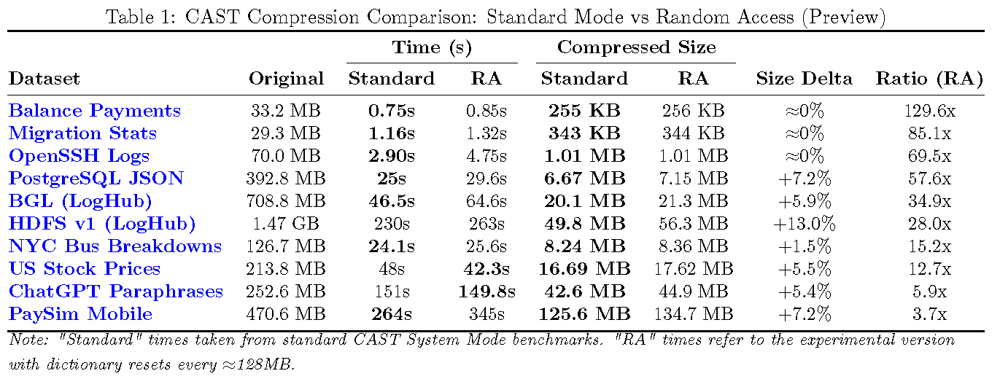
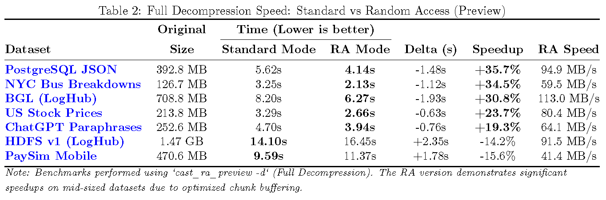

# CAST: Random Access Preview (Experimental WIP)

This directory contains a **Work-In-Progress (WIP) experimental evolution** of the CAST algorithm. It introduces **Random Access** capabilities via Row Groups and Footer Indexing, moving CAST from a pure archival format (like `.tar.gz`) towards a query-ready storage format (like Apache Parquet).

> **⚠️ Note:** The stable implementation described in the current paper is located in the `../rust` directory. Use this version only if you want to **try** granular access to data without full decompression.
>
> **Status:** Experimental. Internal structures and API might change. Comprehensive benchmarks and a formal paper update will follow once the format stabilizes.

---

## 🏗️ Architecture: How it Works

**Leveraging CAST's inherent block-based design**, this version extends the architecture to support independent seeking.

While the standard "Solid Mode" concatenates processed blocks into a single continuous compression stream (to maximize the dictionary usage and compression ratio), this experimental version creates **Independent Row Groups**.

### 1. Smart Chunking Strategy
Instead of blindly cutting files at fixed byte offsets (which would corrupt row structures), CAST RA uses a **Sampling Heuristic**:
1.  Reads the first **1,000 rows** of the input file.
2.  Calculates the **Average Row Size** (in bytes).
3.  Computes the target number of rows to fit the user-requested chunk size (e.g., 64MB).
4.  The stream is then processed and "flushed" every $N$ rows, ensuring cleanly separated blocks.

### 2. Independent Row Groups
Each chunk (or **Row Group**) is treated as a fully self-contained CAST archive:
* It has its own **Dictionary** (the compressor state is reset for each block).
* It contains its own locally optimized **Registry (Templates)** and **Variables**.
* **Trade-off:** This independence enables O(1) random access but implies a slight reduction in compression efficiency compared to the "Solid Mode", as patterns cannot be referenced across block boundaries.

### 3. The Footer Index
At the end of the file, CAST appends a **Metadata Footer** containing:
* **Start Offset** (byte position) of each block.
* **Row Count** for each block.
* **Compressed Size** of each block.

When you request a specific row range (e.g., `--rows 25000-26000`), the decompressor reads the footer, calculates exactly which block contains those rows, seeks directly to that offset, and decompresses **only that block**.

---

## 🚀 Key Features & Limitations

* **Indexed Stream:** The file is split into independent chunks (Row Groups).
* **Partial Decompression:** Extract specific rows (e.g., rows 25,000-26,000) instantly without processing the whole file.
* **Binary Guard:** Automatic handling of binary/mixed content (fallback to passthrough mode) per-chunk.

> **🚧 Current Limitation:** The random access mechanism is currently bound to **Row Indexing** (e.g., "Get rows 100 to 200"). Advanced querying capabilities (such as filtering by column value, SQL-like queries, or predicate pushdown) are part of the future roadmap and are not yet implemented in this preview.

## 📊 Performance Trade-offs (Preliminary)

*Based on initial, non-exhaustive tests performed on a subset of CSV and Log datasets (OpenSSH, PostgreSQL, HDFS, etc.), we observed the following trends compared to the standard "Solid" CAST implementation:*

* **Compression Ratio:** Minimal impact. Most datasets show a **0% to 7% size increase**. Highly dense/massive logs (e.g., HDFS) may see up to ~13% increase due to independent dictionary resets.
* **Compression Speed:** **Variable Overhead.** While some datasets show negligible difference (or even slight speedups), others exhibit a **15% to 40% increase in compression time**. This is due to the computational cost of managing independent dictionary contexts and repeatedly flushing the stream buffers.
* **Decompression Speed (Full File):** Generally faster. We observed a **20% to 35% speedup** on mid-sized datasets (e.g., PostgreSQL, NYC Bus) due to improved I/O chunk buffering. Very large files (>1.5GB) might experience a slight overhead.
* **Random Access:** **O(1) complexity**. Seeking and extracting a small range is instantaneous (**< 0.5s**), regardless of total file size (GBs or TBs).

### Visual Benchmarks
The following charts visualize the **preliminary results** obtained during this early experimental phase.

> **⚠️ Disclaimer:** These benchmarks are **not exhaustive** and cover only a limited subset of datasets to provide an **initial visual impression** of the performance trade-offs. A comprehensive and rigorous analysis will be published once the random access implementation reaches maturity.

#### 1. Compression Size Comparison
This chart visualizes the "cost" of indexing. As shown, the size increase is generally minimal, keeping CAST highly competitive against general-purpose compressors.



#### 2. Full Decompression Speed Comparison
This chart compares the time required to decompress the **entire file**. The block-based architecture often yields faster throughput for mid-sized files.



> **⚡ Important:** The chart above refers to *Full Decompression*. If you use the `--rows` parameter to extract specific ranges, **the operation is near-instantaneous** regardless of the file size, as it only processes the relevant chunk.

---

## 🛠 Usage

> **ℹ️ General Usage:** The CLI commands are **identical** to the [Standard Rust Implementation](../rust/README.md), with the sole addition of the `--rows` parameter for partial decompression. Please refer to the main README for details on dictionary sizes, modes, and verification flags.

### For End Users (No compiling required)
If you just want to test the tool without installing Rust, you can download the **pre-built beta executable** from the Releases page.

### For Developers (Build from source)
If you want to modify the code or build it yourself:

```bash
cd rust_ra_preview
cargo build --release
```

The executable will be located at `target/release/cast_ra_preview`.

### 1. Compress with Indexing
Use `--chunk-size` to define the granularity. A size of **64MB** or **128MB** is recommended for a good balance between seek speed and compression ratio.

```bash
# Creates an index entry roughly every 64MB of input data
./cast_ra_preview -c data.log archive.cast --chunk-size 64MB -v
```

### 2. Random Access (The Magic)
Extract specific rows using human-readable **1-based indexing** (like typical text editors). CAST handles the offset calculation internally.

```bash
# Instantly extracts rows 25,000 to 26,000
./cast_ra_preview -d archive.cast extract.txt --rows 25000-26000
```

---
*Status: Work in Progress / Feature Preview.*
